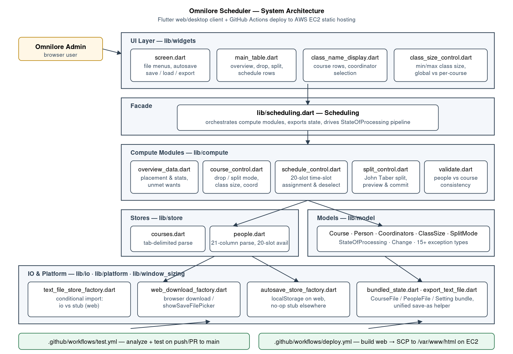
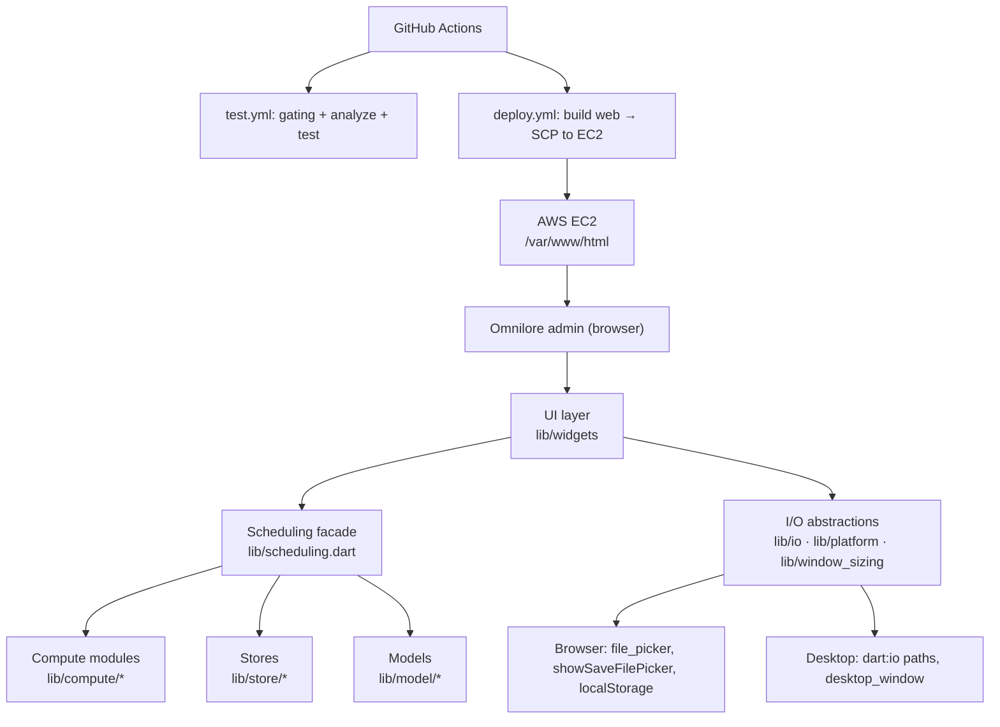
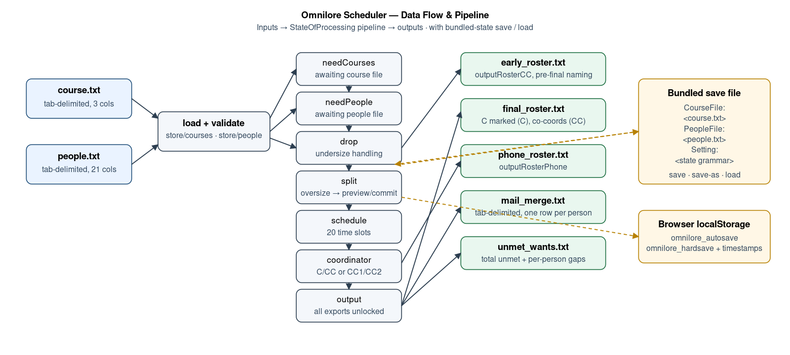
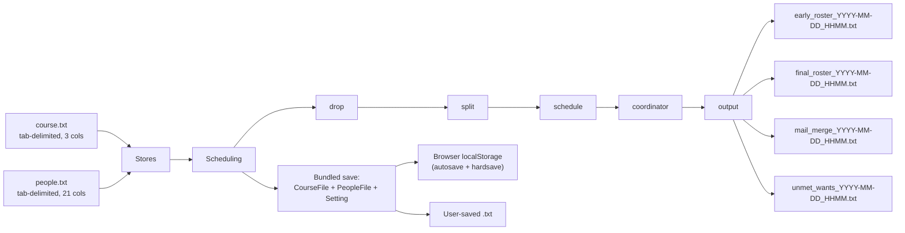
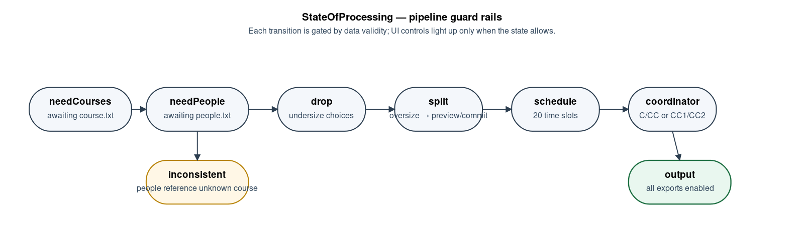

# System Overview and Architecture

**Status date:** April 29, 2026
**Audience:** the next developer who picks up Omnilore Scheduler from Team 34
**Prerequisites:** familiarity with Flutter/Dart and basic AWS EC2 concepts

## 1. Problem and Audience

Omnilore is a member-led lifelong-learning organization in Rancho Palos Verdes, CA. Every term, members rank course preferences (first choices and backups), declare their availability across twenty time slots, and request a specific number of classes (0–6). A small administrative team then has to compute a term schedule that:

1. drops courses that fall under a minimum class size,
2. splits oversize courses into two or more sections,
3. assigns each surviving course to one of twenty time slots,
4. assigns one main coordinator and a co-coordinator (or two equal co-coordinators) to each course, and
5. exposes four export actions: an early roster in phone-roster style, a final roster with coordinator labels, a mail-merge file, and an unmet-wants report.

The previous (pre-2026) implementation was a Flutter desktop application that depended on `dart:io`, native window sizing, and OS file dialogs. Onboarding a new admin meant installing Flutter and the desktop runtime. Several stakeholder-reported defects (the "Co-Coordinator" assignment bug and the "Show Splits" bug) and a missing intermediate-state save/load capability remained outstanding.

**Team 34's mandate (CSCI 401, Spring 2026)** was to migrate the application to a web-based delivery model, fix the two defects, add intermediate state save/load aligned with admin expectations, expand regression testing, and stand up automated cloud deployment. An optional AI-assisted scheduling feature was scoped out by the stakeholder in favor of stability.

## 2. Features Delivered (D1 → D7)

- **Browser-deployable build.** The same Dart codebase compiles for desktop and web. Conditional imports route file I/O, downloads, autosave, and window sizing to platform-appropriate implementations. A static check (`scripts/check_platform_gating.sh`) prevents `dart:io` and other desktop-only imports from leaking into shared code.
- **Two-file load.** Tab-delimited course and people text files are parsed in-browser via `file_picker` and validated against fifteen-plus exception types defined in `lib/model/exceptions.dart`.
- **Drop/Split/Schedule/Coordinator pipeline.** The original desktop pipeline is preserved end-to-end; oversize courses now expose a non-destructive **Show Splits preview** with manual rebalancing and explicit Cancel / Implement controls.
- **Coordinator UX rebuild.** Both `Set C and CC` and `Set CC1 and CC2` now reset selection state on re-entry so admins can fully reassign coordinators; tapping a highlighted name on a coordinator-assigned course clears the assignment.
- **Time-slot deselection.** Clicking the same slot a second time unschedules the course; downstream availability counts recompute.
- **Save / Save As / Load / Autosave / Restore.** `lib/io/bundled_state.dart` produces a single text bundle containing the original course file, the original people file, and the scheduler state grammar — restoring everything from one file. Web autosave uses six `localStorage` keys with timestamped restore-prompts.
- **Four export menu actions.** Early roster (phone-roster style), final roster (with `(C)` / `(CC)` labels), tab-delimited mail-merge, and unmet-wants report. All exports route through a unified helper (`lib/io/export_text_file.dart`) with timestamped filenames from `lib/io/default_filename.dart`; web exports use `showSaveFilePicker` where the browser supports it and fall back to a normal browser download.
- **Cloud deployment.** `.github/workflows/deploy.yml` builds the Flutter web target, briefly whitelists the runner IP in an EC2 security group, copies `build/web/*` to `/var/www/html` over SCP, and revokes the IP — reachable today at http://scheduler.omnilore.org.
- **Continuous validation.** `.github/workflows/test.yml` runs the gating check, `flutter analyze`, and `flutter test` on every push and PR to `main`.

## 3. Architecture



A high-level view of how the layers fit together:



### Layer responsibilities

| Layer | Path | Job |
| --- | --- | --- |
| UI | `lib/widgets/` | Owns Flutter state and renders the main table; hands user actions to `Scheduling` and reacts to its callback. The most active widget files are `screen.dart`, `class_name_display.dart`, `class_size_control.dart`, and `widgets/table/*`. |
| Facade | `lib/scheduling.dart` | The only object the UI talks to. Loads files, delegates compute to the modules below, computes `StateOfProcessing` after every change, and produces all exports. ~809 LOC. |
| Compute | `lib/compute/` | Pure scheduling logic (`overview_data.dart`, `course_control.dart`, `schedule_control.dart`, `split_control.dart`, `validate.dart`). No Flutter, no `dart:io`. |
| Models | `lib/model/` | Plain-Dart data carriers: `Course`, `Person`, `Coordinators`, `ClassSize`, `SplitMode`, `Change`, `StateOfProcessing`, `exceptions.dart`. |
| Stores | `lib/store/` | Tab-delimited parsers for the course and people files. Throw the exception types in `lib/model/exceptions.dart` on malformed input. |
| IO | `lib/io/`, `lib/platform/`, `lib/window_sizing/` | Conditional-import factories that pick a desktop or browser implementation at compile time. |

### Conditional-import pattern (platform gating)

Every desktop-only API is hidden behind a three-file factory:

```dart
// text_file_store_factory.dart
export 'text_file_store_stub.dart'
    if (dart.library.io) 'package:omnilore_scheduler/io/text_file_store_io.dart';
```

`scripts/check_platform_gating.sh` greps the entire `lib/` tree and **fails the build** if `import 'dart:io';` or `import 'package:desktop_window/...';` appears anywhere outside the explicit allowlist. This is also enforced by `test/platform_gating_test.dart`. Whenever you add a new platform-touching feature, follow the same triple of `*_factory.dart` + `*_stub.dart` + `*_io.dart` (or `*_web.dart`) and update the gating script.

## 4. Data Flow





## 5. Pipeline State Machine



`Scheduling._updateStateOfProcessing()` evaluates the eight `StateOfProcessing` values **in order** after every UI-driven `compute(Change)` call:

```text
needCourses → needPeople → inconsistent | drop | split | schedule | coordinator → output
```

| State | Entered when | UI hint |
| --- | --- | --- |
| `needCourses` | course store is empty | "Load courses." |
| `needPeople` | course OK, people store is empty | "Load people." |
| `inconsistent` | a person references an unknown course code | Inline error; admin must fix the input file. |
| `drop` | at least one course is below its minimum class size | Drop / split-mode controls light up. |
| `split` | at least one course is over its maximum size | Show Splits preview is required. |
| `schedule` | all classes sized; some unscheduled | Twenty-slot table is live. |
| `coordinator` | all scheduled; coordinators incomplete | C/CC and CC1/CC2 controls light up. |
| `output` | everything assigned | All exports are unlocked. |

The pipeline is **monotonic forward** but reactive backward: dropping a course or rebalancing a split rewinds downstream stages and the UI greys out their controls until the upstream constraint is satisfied again.

## 6. Key Design Choices

- **Single Dart engine for desktop and web.** The compute and model layers are pure Dart with no Flutter or `dart:io` dependencies. This keeps the desktop-vs-web fork to the I/O surface only, which is the smallest possible blast radius.
- **Bundled save format.** A single text file (`CourseFile:` + `PeopleFile:` + `Setting:` sections) restores the entire working session. This was chosen over JSON because (a) it remains diff-friendly and human-readable for stakeholder review, (b) it allows admins to hand-edit a snapshot if needed, and (c) it preserves the original tab-delimited input bytes — useful for traceability and re-running.
- **Autosave is convenience, not durability.** Web autosave writes to browser `localStorage` and is therefore tied to that browser profile and device. The user-facing message and the runbook treat `Save As` to a real file as the only operational backup.
- **No backend.** The application is entirely client-side. There is no database, no auth, no API, and no PII server-side. PII (names, phone numbers) lives only in the admin's browser session and in the files they choose to save.
- **Static-asset deploy.** The web build is just static files. EC2 + nginx/Apache was the path of least resistance because Omnilore already has an AWS account; the doc includes a recommendation to migrate to S3 + CloudFront in the long term (see `Backlog_Known_Issues_Roadmap.md`, P2).
- **Aggressive platform gating.** Catching a desktop-only import at CI time is cheap; debugging a runtime `dart:io` failure in a stakeholder's browser is not. The grep-based gating script and matching test prevent that.

## 7. Known Limits

- The app is a single-user, client-side scheduling tool. There is no shared state, multi-user collaboration, audit log, or user identity.
- Browser autosave is browser-profile-scoped. Switching browsers, profiles, or devices loses the autosave; admins must `Save As` to a portable bundle.
- `showSaveFilePicker` support varies by browser. On unsupported browsers (notably Firefox at the time of writing) the save flow falls back to a normal download.
- AWS deployment currently overwrites `/var/www/html` on EC2 in place. There is no automated rollback artifact; rollback is "redeploy a known-good commit" (see `Operations_Runbook.md`).
- Performance under unusually large datasets (well beyond the 24-course / 267-person fixture) is not separately profiled.
- The optional AI-assisted scheduling enhancement from D1 was deferred by stakeholder agreement and is **not** delivered.

## 8. Where to extend the system

| Need | Touch this | Watch out for |
| --- | --- | --- |
| Add a new export | New `outputXyzToString()` on `Scheduling`; route through `exportTextFile()` | Keep the gate check on `StateOfProcessing` so disabled actions stay disabled. |
| Add a new pipeline stage | New `StateOfProcessing` enum value + branch in `_updateStateOfProcessing()`; new compute module under `lib/compute/` | Update the bundled-state grammar and the legacy state loader (`Scheduling.loadState`). |
| Add CSV exports | Wrap the existing string-builders with a CSV serializer alongside the tab-delimited form | Mail-merge already produces tab-delimited rows; adding a CSV output is mostly a header + escaping pass. |
| Move off EC2 to S3 + CloudFront | Replace `deploy.yml` with `aws s3 sync build/web s3://…` + an invalidation step | Update `Operations_Runbook.md` and the rotation table; archive the EC2 host config. |
| Add a backend (e.g., shared term schedules) | A new `lib/api/` package with conditional Web/desktop transport; gate it the same way as I/O | Introduces auth and PII at rest — re-evaluate `Security_Privacy_Accessibility_UX_Notes.md` before implementing. |

## 9. Repository inventory (for the next developer)

```text
lib/
  scheduling.dart                 # facade — start here
  main.dart                       # Flutter entry + theme
  widgets/                        # UI
    screen.dart                   # main screen, file menus, autosave
    class_name_display.dart       # course rows + coordinator selection
    class_size_control.dart       # min/max class-size controls
    overview_data.dart            # overview/stats panel
    table/{main_table, drop_row, schedule_row, class_name_row, overview_row}.dart
    names_display_mode.dart, utils.dart
  compute/
    overview_data.dart            # placement + unmet wants
    course_control.dart           # drop, split mode, class size, coordinators
    schedule_control.dart         # 20-slot scheduling state
    split_control.dart            # split preview/commit (John Taber's algorithm)
    validate.dart                 # people vs courses consistency
  model/
    course.dart, person.dart, coordinators.dart, class_size.dart
    state_of_processing.dart, change.dart, exceptions.dart
  store/
    courses.dart, people.dart, list_item.dart
  io/
    text_file_store_factory.dart   # conditional import gate
    text_file_store_stub.dart, text_file_store_io.dart, text_file_store.dart
    web_download_factory.dart, web_download.dart, web_download_stub.dart, web_download_web.dart
    autosave_store_factory.dart, autosave_store_stub.dart, autosave_store_web.dart
    bundled_state.dart             # Save / Save As / Load bundle
    default_filename.dart           # timestamped export/save filenames
    export_text_file.dart          # unified save-as helper
    file_io_exceptions.dart
  platform/
    desktop_platform.dart, desktop_platform_stub.dart, desktop_platform_io.dart
  window_sizing/
    window_sizing.dart, window_sizing_desktop.dart, window_sizing_noop.dart
  theme.dart
test/                             # 21 .dart test files, 89 passing tests (see Testing_and_QA_Summary.md)
.github/workflows/
  test.yml                        # CI
  deploy.yml                      # build web → SCP to EC2
scripts/
  check_platform_gating.sh        # grep-based desktop-import gate
docs/                             # earlier-deliverable working docs
Project_Docs_D7/                  # D7 handoff source docs + rendered deliverables
```
